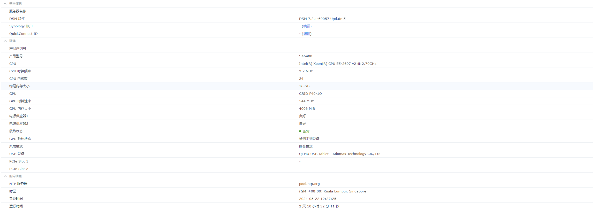

# PVE + 虚拟黑裙SA6400 + LSI SAS2008 + GRID P40-1Q

## 1.首先先按照以下环境安装完vGPU的环境
[NVIDIA vGPU Guide](https://gitlab.com/polloloco/vgpu-proxmox)

## 2.然后依照教学安装NVIDIA驱动到DSM
[Synology 群晖 Nvidia vGPU/GPU 实践指南](https://blog.kkk.rs/archives/12)

## 3.然后请根据以下步骤完成

>[!Note]
> 由于群辉引导的特殊性，普通vgpu_unlock中的`profile_override`文件无法根据普通虚拟机的设置进行自定义显存大小。所以需要用一些特殊方法来达成。

### 3.1 编辑profile_override文件
```bash
nano /etc/vgpu_unlock/profile_override.toml
```

### 3.2 根据步骤1中加入以下参数(以我为例子)
```toml
[profile.nvidia-46]
num_displays = 1 # 虚拟显示器的最大数量。 如果您想要一个简单的远程游戏虚拟机，通常为 1
display_width = 1920 # 虚拟机中的最大显示宽度
display_height = 1080 # 虚拟机中的最大显示宽度
max_pixels = 2073600 # 这是display_width和display_height的乘积，所以1920 * 1080 = 2073600
cuda_enabled = 1 # 启用 CUDA 支持。 1 或 0 表示启用/禁用
frl_enabled = 0 # 这控制帧速率限制器，如果启用它，虚拟机中的 fps 会锁定为 60fps。 1 或 0 表示启用/禁用
framebuffer = 0xEC000000
framebuffer_reservation = 0x14000000

[vm.104]
#2G-VM-001-SV
framebuffer = 0x74000000
framebuffer_reservation = 0xC000000
num_displays = 1
frl_enabled = 0
display_width = 1920
display_height = 1080
max_pixels = 2073600
```

> [!WARNING]  
> 在 **`[profile.nvidia-46]`** 内必须要有 **`framebuffer`** 和 **`framebuffer_reservation`** 否则他会以你选的默认配置文件的设定进行分配 <br>
> 例如：**`[profile.nvidia-46]`** 的默认是1024M，那么你的群辉就只会看到1024M的显存

>[!Note]
> 相信大家看到这边还是会有点懵懵懂懂的下面我就来为大家解释下
> <br>
> 大家看到这个 **`GRID P40-1Q(nvidia-46)`** 这个文件中旁边有写明一个叫 **`framebuffer`** 的选项写着 **`1024M`** 代表这个配置文件中所有使用此配置文件虚拟机的虚拟机都是1024M大小的VRAM，3.2中的 **`[profile.nvidia-46]`** 代表强制重写这个配置文件，由于群辉的引导不受vGPU_unlock这个程序控制，所以不能像3.2中的 **`[vm.104]`** 那样指定VRAM大小，所以我只能换个方式来让群辉可以在1G VRAM的配置文件上可以设置成4G，当然你可以选择直接给用4G的配置文件，但是这样的话你的虚拟机能用vGPU的数量会减少
>
> 例如一张24G显存的VRAM那么在默认的配置文件里面我只能有6架虚拟机可以用vGPU(24/4=6)，相反的如果我用1G的配置文件，我可以有24架虚拟机可以用vGPU，前提是你的虚拟机使用的VRAM不能超过显卡VRAM。
>
> VGPU_Unlock这个程序的本质是为了让我们可以灵活的分配VRAM，避免造成显卡资源的浪费。可是群辉引导的特殊性不受VGPU_Unlock控制所以我们只能反向而行

### 3.3以下是VRAM自定义大小的参数
## 来源:[NVIDIA vGPU on Proxmox](https://gitlab.com/polloloco/vgpu-proxmox/-/tree/master?ref_type=heads)
- 512MB:
  ```toml
  framebuffer = 0x1A000000
  framebuffer_reservation = 0x6000000
  ```
- 1GB:
  ```toml
  framebuffer = 0x38000000
  framebuffer_reservation = 0x8000000
  ```
- 2GB:
  ```toml
  framebuffer = 0x74000000
  framebuffer_reservation = 0xC000000
  ```
- 3GB:
  ```toml
  framebuffer = 0xB0000000
  framebuffer_reservation = 0x10000000
  ```
- 4GB:
  ```toml
  framebuffer = 0xEC000000
  framebuffer_reservation = 0x14000000
  ```
- 5GB:
  ```toml
  framebuffer = 0x128000000
  framebuffer_reservation = 0x18000000
  ```
- 6GB:
  ```toml
  framebuffer = 0x164000000
  framebuffer_reservation = 0x1C000000
  ```
- 8GB:
  ```toml
  framebuffer = 0x1DC000000
  framebuffer_reservation = 0x24000000
  ```
- 10GB:
  ```toml
  framebuffer = 0x254000000
  framebuffer_reservation = 0x2C000000
  ```
- 12GB:
  ```toml
  framebuffer = 0x2CC000000
  framebuffer_reservation = 0x34000000
  ```
- 16GB:
  ```toml
  framebuffer = 0x3BC000000
  framebuffer_reservation = 0x44000000
  ```
- 20GB:
  ```toml
  framebuffer = 0x4AC000000
  framebuffer_reservation = 0x54000000
  ```
- 24GB:
  ```toml
  framebuffer = 0x59C000000
  framebuffer_reservation = 0x64000000
  ```
- 32GB:
  ```toml
  framebuffer = 0x77C000000
  framebuffer_reservation = 0x84000000
  ```
- 48GB:
  ```toml
  framebuffer = 0xB2D200000
  framebuffer_reservation = 0xD2E00000
  ```

## 分享本人成功案例
### 环境:
| 环境 |  版本   |
|-----|---------|
| PVE | 8.2(6.5.13-5-pve) |
| DSM | 7.2     |
| 机型 |SA6400   |
| 引导 |ARC Loader 24.5.16|
|NVIDIA_HOST驱动版本|535.161.05|


### 硬件配置:
|   硬件   |  配置  |
|---------|--------|
|处理器|E5-2697v2|
|主板|X9SRL-F|
|内存|8x三星32G 1600 4R*4(256G)|
|固态硬盘(系统)|Micro 7300 Pro 1920GB|
|显卡|Tesla-P40(vGPU)|
|   |Tesla-P4(直通VM)|
|HBA卡|Broadcom / LSI SAS2008 PCI-Express Fusion-MPT SAS-2 [Falcon] (rev 03)|
|电源|darkFlash GS650W|





